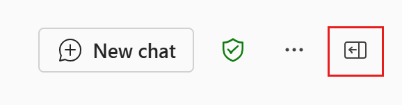
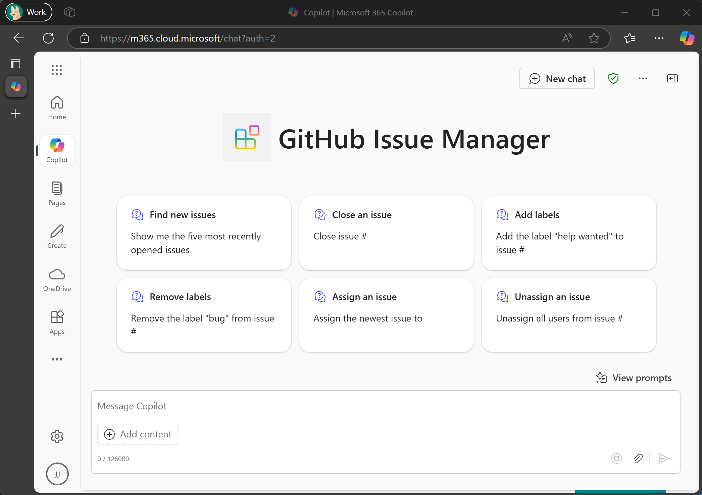

<!--
---
page_type: sample
description: This sample demonstrates how to use a Microsoft Graph connector, declarative agent, and an API plugin API to create to create an issue management agent for Microsoft 365 Copilot
products:
- ms-graph
- github
- microsoft-365-copilot
languages:
- csharp
---
-->

# GitHub Issue Manager sample agent

GitHub Issue Manager is a sample solution for extending Microsoft 365 Copilot. It combines multiple extensibility options to create a full solution for managing issues in a GitHub repository. This sample consists of:

- A [Microsoft Graph connector](https://learn.microsoft.com/microsoft-365-copilot/extensibility/overview-graph-connector) that ingests GitHub issues. Ingesting the issues allows Microsoft 365 Copilot to reason over the contents of those issues.
- A [GitHub webhook](https://docs.github.com/webhooks/about-webhooks) (implemented as an Azure Function) that receives notifications when issues are created or updated. These notifications trigger the Microsoft Graph connector to ingest new issues or re-ingest updated issues.
- A [declarative agent](https://learn.microsoft.com/microsoft-365-copilot/extensibility/overview-declarative-agent) configured to use the data from the Microsoft Graph connector to generate responses.
- An [API plugin](https://learn.microsoft.com/microsoft-365-copilot/extensibility/overview-api-plugins) (and corresponding API) that adds actions to the declarative agent, allowing it to label, assign, or close issues.

## Prerequisites

- [.NET SDK](https://dotnet.microsoft.com/download) 9.0
- [Visual Studio Code](https://code.visualstudio.com/) with the following extensions:
  - [C#](https://marketplace.visualstudio.com/items?itemName=ms-dotnettools.csharp)
  - [Azure Functions](https://marketplace.visualstudio.com/items?itemName=ms-azuretools.vscode-azurefunctions)
  - [Azurite](https://marketplace.visualstudio.com/items?itemName=Azurite.azurite)
  - [Teams Toolkit](https://marketplace.visualstudio.com/items?itemName=TeamsDevApp.ms-teams-vscode-extension)
  - [REST Client](https://marketplace.visualstudio.com/items?itemName=humao.rest-client)
- [devtunnel CLI](https://learn.microsoft.com/azure/developer/dev-tunnels/get-started)

### Microsoft 365 account requirements

You need either:

- A licensed Microsoft 365 Copilot user account in a Microsoft 365 subscription
- A user account in a Microsoft 365 subscription that has enabled metered usage of Microsoft 365 Copilot

This user must have the ability to sideload custom apps. For details, see [Teams Toolkit requirements](https://learn.microsoft.com/microsoft-365-copilot/extensibility/prerequisites#teams-toolkit-requirements).

To configure the Microsoft Graph connector, you will need administrator accounts with the following roles:

- Privileged Role Administrator to grant tenant-wide application permission to the connector
- Search Administrator to enable the connector in the Microsoft 365 admin center

A Global Administrator can also be used to perform both tasks.

> [!NOTE]
> The administrator roles can be assigned to your user account, or you can ask your administrators to complete their respective steps.

## Set up the sample

1. Open the directory or folder that contains this project in Visual Studio Code.
1. Select **Teams Toolkit** in the [Activity Bar](https://code.visualstudio.com/docs/getstarted/userinterface#_basic-layout).
1. In the **Accounts** section, sign in to Microsoft 365 and Azure with your user account.

### Register an application in Microsoft Entra

Teams Toolkit will automate registering an application for you.

1. Select **Terminal** then **Run Task...** from the Visual Studio Code menu. Alternatively, you can press **CTRL**+**SHIFT**+**P** and search for **Tasks: Run Task**.
1. Select the **register app** task.
1. Confirm that the **./src/local.settings.json** file has been generated.

If you are unable to register an application using this method, you can [register an application in the Microsoft Entra portal](portal-registration.md).

### Create a persistent devtunnel

Creating a devtunnel will generate a URL that both GitHub and Microsoft 365 Copilot can use to connect to the sample running on your local machine.

1. If you are not already logged in to the devtunnel CLI, use `devtunnel user login --help` to see the available login options. Login to the CLI before proceeding.

1. Create the tunnel.

    ```powershell
    devtunnel create --allow-anonymous
    ```

    Copy the **Tunnel ID** from the output.

1. Add port 7071 to the tunnel.

    ```powershell
    devtunnel port create -p 7071
    ```

1. Start the dev tunnel.

    ```powershell
    devtunnel host
    ```

1. Copy the URL labeled **Connect via browser**. This is your devtunnel URL.

1. Set the `DevTunnel` property in **./src/local.settings.json** to your devtunnel URL.

1. Add the following line in **./agent/env/.env.dev**, replacing `YOUR_DEVTUNNEL_URL` with your devtunnel URL. If the file does not exist, create it.

    ```ini
    DEVTUNNEL_URL=YOUR_DEVTUNNEL_URL
    ```

> [!TIP]
> If you need to restart your devtunnel, you can restart it using its **Tunnel ID** with the following command.
>
> ```powershell
> devtunnel host TUNNEL_ID
> ```

### Configure GitHub access

This sample uses a personal access token to authenticate API calls to the GitHub API and a repository webhook to receive event notifications from GitHub.

1. Create a fine-grained personal access token with the **Read access to metadata** and **Read and Write access to issues** permissions in the GitHub repository you want to manage issues for. For instructions, see [Creating a fine-grained personal access token](https://docs.github.com/en/authentication/keeping-your-account-and-data-secure/managing-your-personal-access-tokens#creating-a-fine-grained-personal-access-token).

1. Create a repository webhook using the following values:

    - **Payload URL** - Set to your devtunnel URL + `/api/Notify`. For example, if your devtunnel URL is `https://xxxxxxxx-7071.use2.devtunnels.ms`, you would set this to `https://xxxxxxxx-7071.use2.devtunnels.ms/api/Notify`.
    - **Content type** - `application/json`
    - **Secret** - Set a strong password
    - **SSL verification** - **Enable SSL verification**
    - **Which events would you like to trigger this webhook?** - **Let me select individual events** with **Issues** and **Issue comments** selected.

1. Set the following values in **./src/local.settings.json**:

    - Add the token in the `GitHubOptions:PersonalAccessToken` property
    - Add the password you set in the **Secret** value for the webhook in the `GitHubOptions:WebhookSecret` property
    - Add the repository owner in the `GitHubOptions:RepoOwner` property
    - Add the repository name in the `GitHubOptions:RepoName` property

> [!TIP]
> You can find the repository's owner and name from the URL to the repository. For example, if the repository's URL is `https://github.com/microsoftgraph/github-issue-manager`, the repository's owner is `microsoftgraph`, and the repository name is `github-issue-manager`.

### Initialize the Microsoft Graph connector

1. In Visual Studio Code press **CTRL**+**SHIFT**+**P** and select **Azurite: Start**. This will start the Azurite emulator.
1. Select **Run** then **Start Debugging**. Wait for the project to build and start.
1. Open [manage-connector.rest](manage-connector.rest). Locate the `POST http://localhost:7071/api/Initialize` line and select the **Send Request** command above it. If you don't see **Send Request**, make sure you have the **REST Client** extension installed.
1. Monitor the output in the **Terminal** window for a message that starts with `You need to grant tenant-wide admin consent to the application in Entra ID`. The message includes a link that your admin can use to grant tenant-wide consent. Do this before proceeding.
1. Resend the request from **manage-connect.rest**.
1. Monitor the output in the **Terminal** window for progress. The sample will create an external connection, register a schema for that connection, and then crawl all existing issues in the GitHub repository. This process may take several minutes, depending on the number of issues in your repository. When you see `Crawl took X seconds` in the output, the connector has been fully initialized.

### Sideload the agent to Microsoft 365 Copilot

1. Select **Teams Toolkit** in the Activity Bar.
1. Select **Provision**.
1. When prompted to enter an API key, enter any string 10 characters or longer. Wait for the actions to complete.

> [!NOTE]
> The API key is ignored when running Azure Functions locally, so any value will work for local testing.

## Using the sample

> [!IMPORTANT]
> Make sure that both the sample and the devtunnel are running before trying to use the sample in Microsoft 365 Copilot.

1. Open your browser and navigate to [https://m365.cloud.microsoft/chat?auth=2](https://m365.cloud.microsoft/chat).
1. If the right-hand pane with a list of agents is not visible, locate the panel icon in the top right of the page and select it to expand the panel.

    

1. Select **GitHub Issue Manager** in the right-hand pane.
1. Select one of the sample prompts, or try creating your own. The agent can get information about issues, add or remove labels, assign or unassign users, and close issues.

    
